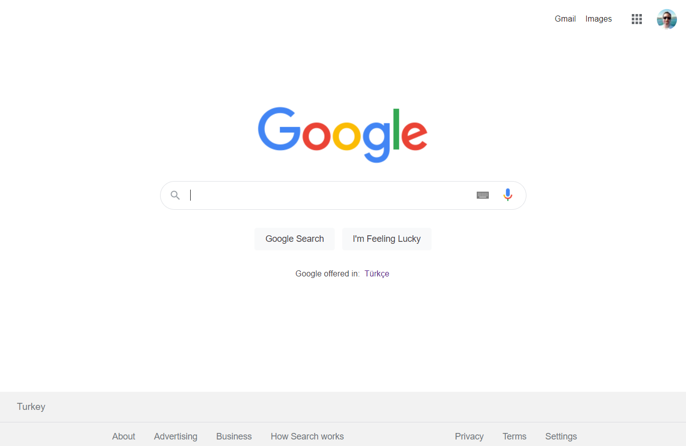

# Kodluyoruz - CSS Ödev 3
## Google'ın bugünkü ana sayfasının tasarlanması 
Tasarım Görseli;



## About Project
Bu repo, [Kodluyoruz](https://kodluyoruz.org) Front-End Eğitiminde oluşturduğum 3. CSS ödevim.

Projemde linkler ve hooverlar ( navigation butonları, search butonları, profil resmi çevresi vs. ) çalışıyor.

## Installation
Projeyi klonlayarak kullanabilirsiniz. 
```
https://github.com/aybarsumur/kodluyoruzilkrepo.git
```